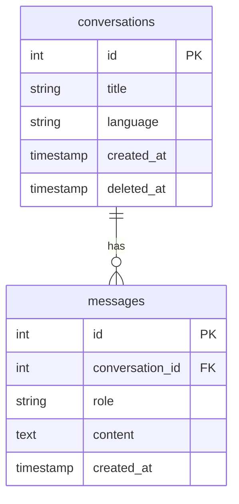

# Database ERD

```mermaid
erDiagram
    conversations ||--o{ messages : "has"

    conversations {
        int id PK
        string title
        string language
        timestamp created_at
        timestamp deleted_at
    }

    messages {
        int id PK
        int conversation_id FK
        string role
        text content
        timestamp created_at
    }
    
```